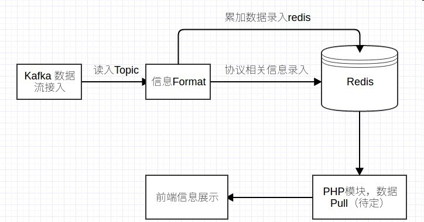

# 灵眸 系统设计

## 系统架构图

## kafka topic 读入（hw）
接kafka的top 读入到py模块中作为预处理数据

## 流数据处理（la）
将kafka的topic数据，转化为json数据并存入redis。
这里需要处理，保证数据池中的相对长度不要过高。
通过设置redis过期时间来保证请求数据过程中数据的一致性，数据的时效性问题

## redis数据取出，web容器（ht，cw）
取出redis数据
> 如果js直接通过redis取数据，则不用php模块 

## 前端展示（haow，cw，ht）
将json数据展示到前端页面。

## json数据格式
数据分为两类：
- 实时展示数据
- 统计数据

