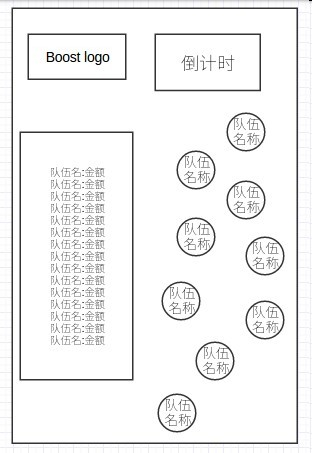

# 灵眸 v0.2

## web页面新增改动

- 心跳显示区域，增加广告logo
- 增加图例并标注产品线名称。（前端写死即可）

## 现场活动需求
通过一定的奖励，使得用户喜欢来体验我们的产品，每个点击会加到相应的队伍上0.5元。
- 现场互动：
	- 用户点击，点击数据作为一种广告形式发入到kafka中。
	- 13个队伍作为广告主加入到活动中，广告主ip设为，队伍人员的所在地区即可。
	- web页，实时展示用户点击情况，作为一个新加入的产品线。
	- 用户点击页，此也通过生成的二维码在手机浏览器中打开。效果如图

> web页实时展示队伍分成金额。
> 倒计时时间为后端模块可控。我们直接刷新配置就可以。
> 点击icon时，生成kafka数据录入kafka中。
> 队伍icon 特效

